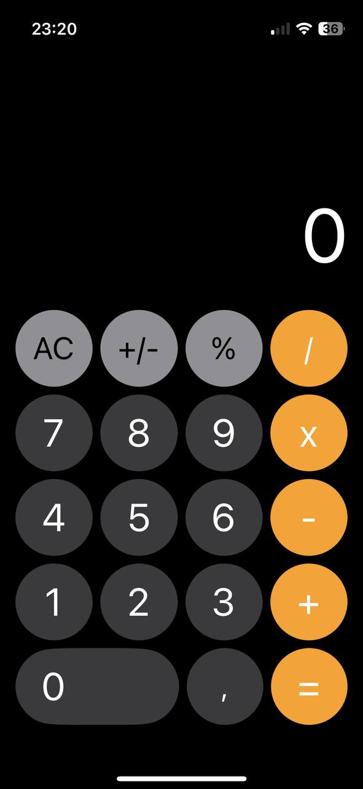

# Calculator

This project is 95% (at the moment) a replica of Apple's calculator for iOS 17, which is no longer available in the new version from September 16, 2024

## Installation

Setup devTeam here

```swift
settings: SettingsDictionary.default(.debug, devTeam: "", build: "1.0.0", version: "1")
```

Then

```bash
tuist generate
```



## License

[MIT](https://choosealicense.com/licenses/mit/)
